# Active Directory Project

## Project Description

In this project, I set up an Active Directory server connected to a Windows 10 machine as well as a Splunk server to monitor attacks coming from a Kali Linux machine. Before starting, I did some free training from Microsoft to learn more about Windows Server and Active Directory, as well as Splunk's introductory course.

Thanks to [MyDFIR](https://www.youtube.com/@MyDFIR) for providing the project idea and guide on his YouTube channel.

**Table of Contents**
- [Active Directory Project](#active-directory-project)
  - [Project Description](#project-description)
  - [Part 1: Diagram](#part-1-diagram)
    - [Objective: Create a Logical Diagram](#objective-create-a-logical-diagram)
  - [Part 2: Virtual Machines](#part-2-virtual-machines)
    - [Objective: Install Virtual Machines](#objective-install-virtual-machines)
    - [Install Windows 10](#install-windows-10)
    - [Install Kali Linux](#install-kali-linux)
    - [Install Windows Server](#install-windows-server)
    - [Install Ubuntu Server](#install-ubuntu-server)
  - [Part 3: Sysmon and Splunk](#part-3-sysmon-and-splunk)
    - [Objective: Install and Configure Splunk and Sysmon](#objective-install-and-configure-splunk-and-sysmon)
    - [VirtualBox NAT Network Configuration](#virtualbox-nat-network-configuration)
    - [Splunk Server Configuration](#splunk-server-configuration)
      - [Configure the Splunk machine's IP](#configure-the-splunk-machines-ip)
      - [Download Splunk](#download-splunk)
      - [Configure guest add-ons for VirtualBox](#configure-guest-add-ons-for-virtualbox)
      - [Add a user to the vboxsf group and mount the shared folder](#add-a-user-to-the-vboxsf-group-and-mount-the-shared-folder)
      - [Install Splunk](#install-splunk)
    - [Windows 10 User Configuration](#windows-10-user-configuration)
      - [Change the Windows 10 machine's hostname](#change-the-windows-10-machines-hostname)
      - [Check the Windows 10 machine's IP](#check-the-windows-10-machines-ip)
      - [Install Splunk Universal Forwarder](#install-splunk-universal-forwarder)
      - [Install Sysmon](#install-sysmon)
      - [Specify what logs from the Windows 10 machine to send to Splunk](#specify-what-logs-from-the-windows-10-machine-to-send-to-splunk)
      - [Finalize the Splunk Server configuration](#finalize-the-splunk-server-configuration)
    - [Windows Server 2022 Configuration](#windows-server-2022-configuration)
  - [Part 4: Active Directory](#part-4-active-directory)
    - [Objective: Install and Configure Active Directory](#objective-install-and-configure-active-directory)
      - [Setup Active Directory](#setup-active-directory)
      - [Add an Organizational Unit (OU) and a User](#add-an-organizational-unit-ou-and-a-user)
      - [Utilize PowerShell to create a user creation script](#utilize-powershell-to-create-a-user-creation-script)
      - [Configure the Windows 10 machine to join the domain](#configure-the-windows-10-machine-to-join-the-domain)
  - [Part 5: Kali Linux and Atomic Red Team (ART)](#part-5-kali-linux-and-atomic-red-team-art)
    - [Objective: Perform a brute force attack and set up ART](#objective-perform-a-brute-force-attack-and-set-up-art)
      - [Enable RDP on the target machine](#enable-rdp-on-the-target-machine)
      - [Configure the Kali Linux machine's IP](#configure-the-kali-linux-machines-ip)
      - [Use Nmap to scan the target machine](#use-nmap-to-scan-the-target-machine)
      - [Install Crowbar and download a password list](#install-crowbar-and-download-a-password-list)
      - [Perform a brute force attack with Crowbar](#perform-a-brute-force-attack-with-crowbar)
      - [Check Splunk for evidence of the brute force attack](#check-splunk-for-evidence-of-the-brute-force-attack)
      - [Installing Atomic Red Team](#installing-atomic-red-team)
      - [Example use of ART](#example-use-of-art)
  - [Conclusion](#conclusion)

## Part 1: Diagram

### Objective: Create a Logical Diagram

To begin, I used Draw.io to map out the lab environment logically.

- Two user computers were used. One running Windows 10 and another running Kali Linux.
- Two servers were set up. One for Splunk and another for Active Directory.

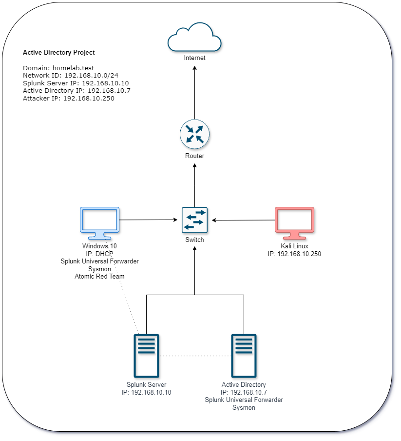

Creating a diagram is useful to better understand how data will flow and how components are connected. The diagram was referenced throughout the project.

## Part 2: Virtual Machines

### Objective: Install Virtual Machines

In this section, I installed four virtual machines on VirtualBox as described in the following table:

| Virtual Machine | Description |
| --- | --- |
| Windows 10 | Target machine |
| Kali Linux | Attacker's machine |
| Windows Server 2022 | Active Directory |
| Ubuntu Server 22.04 | Splunk |

### Install Windows 10

Since I already had VirtualBox installed, I began installing the first virtual machine.

To install Windows 10 onto VirtualBox, I executed the following steps:

1. Navigate to https://www.microsoft.com/en-us/software-download/windows10 and download the Windows  10 media creation tool.

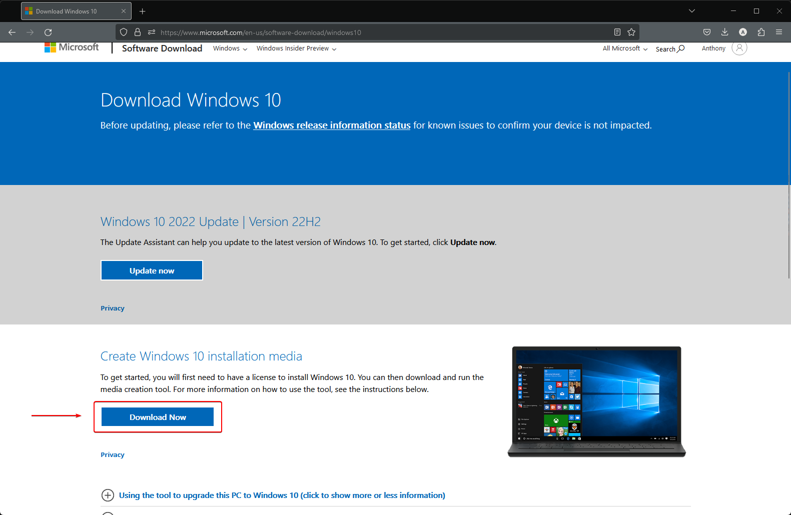

2. Run the tool and accept the license terms.
3. Select 'Create installation media (USB flash drive, DVD, or ISO file) for another PC' and click Next.
4. Check 'Use the recommended options for this PC' and click Next.
5. Select 'ISO file' and click Next.
6. Save the ISO file to your folder of choice.  

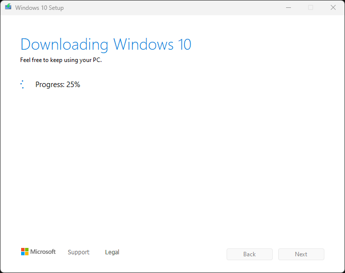

7. After the ISO finishes downloading, open VirtualBox and click 'New' to create a new virtual machine.
8. Set the name to "Windows-10-User", choose a folder, select the `Windows.iso` file previously created, check 'Skip Unattended Installation', and click Next.

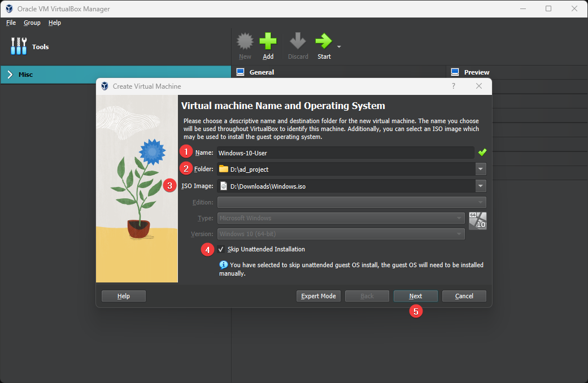

9. Set 'Base Memory' to 4096 MB (which is 4 GB) and click Next.
10. Leave the Virtual Hard Disk at 50.00 GB and click Next.
11. Click Finish on the Summary page to finalize the virtual machine install.
12. Click the green arrow labeled 'Start' to power on the machine.

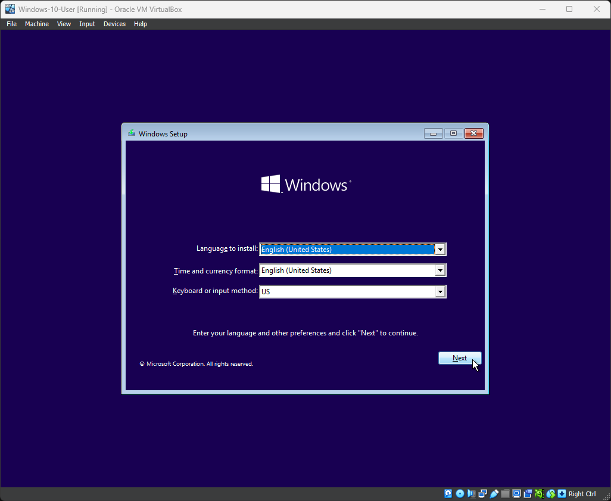

13. Click Next.
14. Click 'Install now'.
15. Select 'I don't have a product key'.
16. Select 'Windows 10 Pro' and click Next.
17. Accept the license terms and click Next.
18. Select 'Custom: Install Windows only (advanced)'.
19. Click Next.
20. Wait for Windows 10 to install.


### Install Kali Linux

To install Kali Linux onto VirtualBox, I executed the following steps:

1. Navigate to https://www.kali.org/get-kali/#kali-virtual-machines and download the 64-bit pre-built VirtualBox virtual machine.

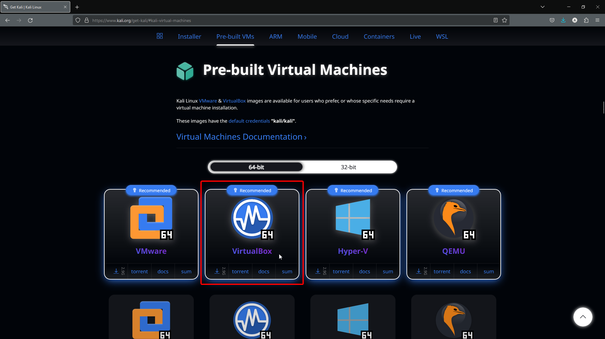

3. Extract the downloaded archive.

4. Double-click on the Kali Linux virtual machine file with the `.vbox` extension to import it into VirtualBox.

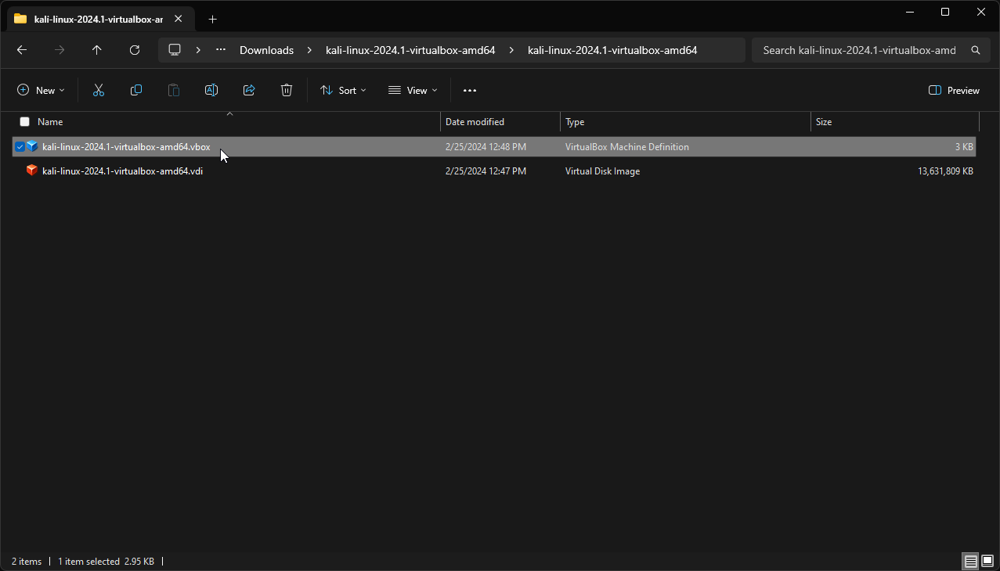
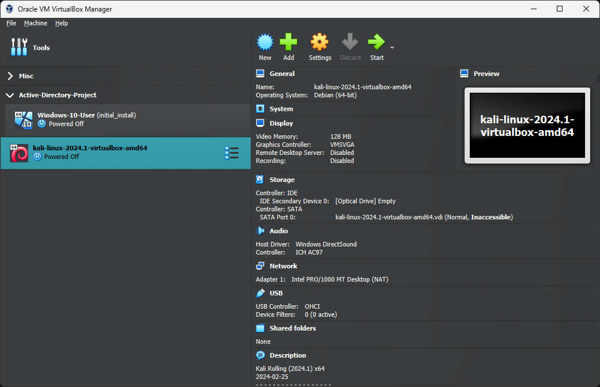

> [!NOTE]
> At first, I did not extract the downloaded archive before adding the Kali virtual machine to VirtualBox. This caused errors when attempting to start the machine.

> [!TIP]
> If you want to move the install location of a virtual machine in VirtualBox, right-click on the machine and select 'Move'. 

### Install Windows Server

To install Windows Server onto VirtualBox, I executed the following steps:

1. Navigate to https://www.microsoft.com/en-us/evalcenter/download-windows-server-2022 and download the Windows Server 2022 64-bit ISO.


2. After the ISO finishes downloading, open VirtualBox and click 'New' to create a new virtual machine.
3. Set the name to "ADDC-01", choose a folder, select the Windows Server ISO file previously downloaded, check 'Skip Unattended Installation', and click Next.
   
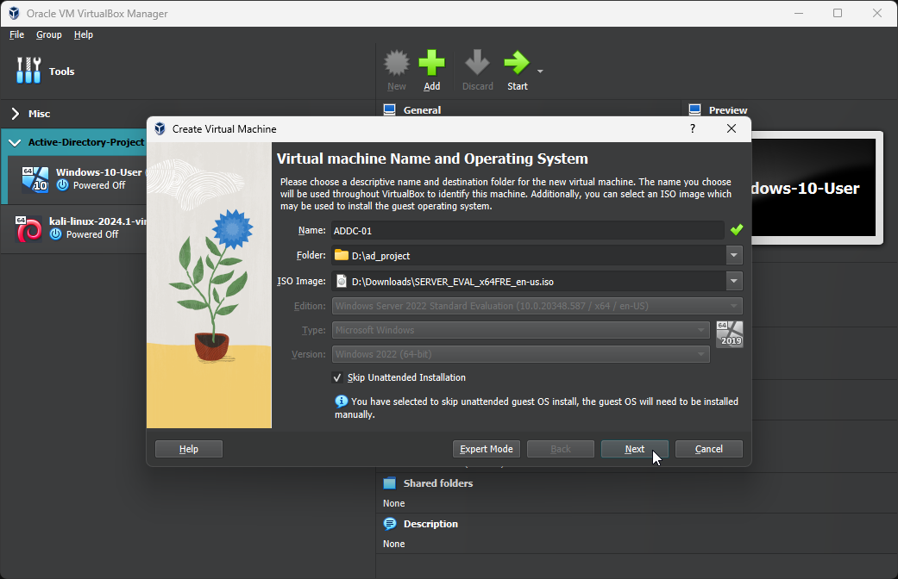

4. Set 'Base Memory' to 4096 MB and click Next.
5. Leave the Virtual Hard Disk at 50.00 GB and click Next.
6. Click Finish on the Summary page to finalize the virtual machine install.
7. Click the green arrow labeled 'Start' to power on the machine.
   
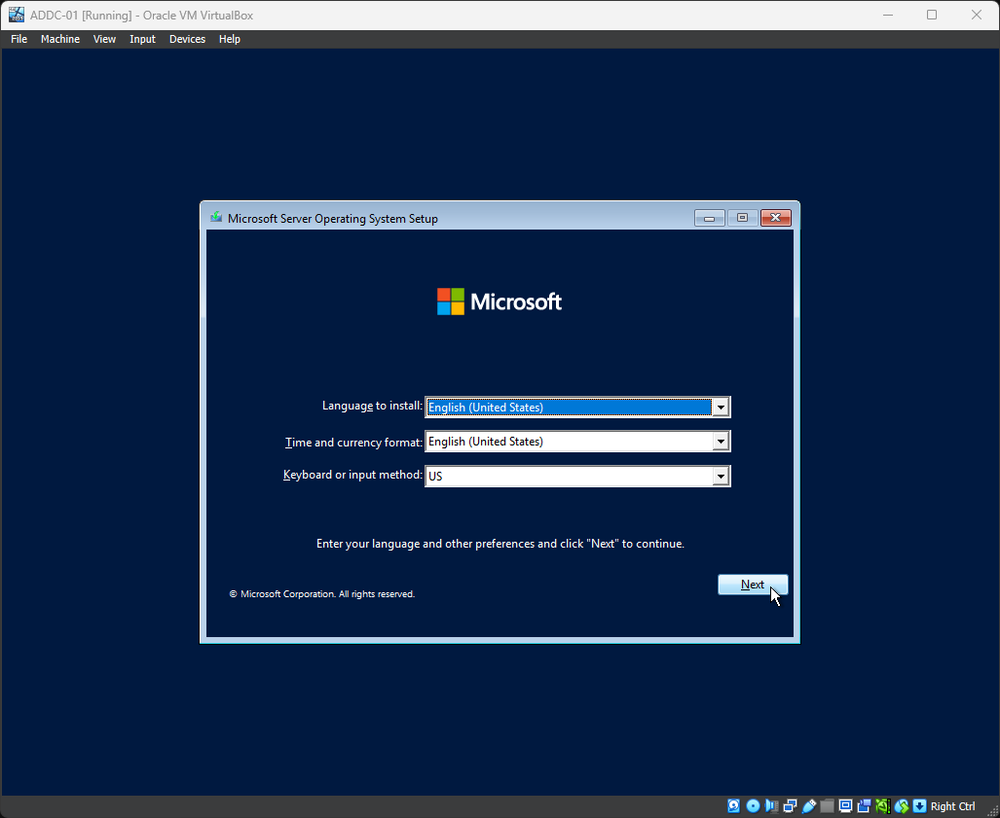

8. Click Next.
9. Click 'Install now'.
10. Select 'Windows Server 2022 Standard Evaluation' (Desktop Experience) and click Next.
11. Accept the license terms and click Next.
12. Select 'Custom: Install Microsoft Server Operating System only (advanced)'.
13. Click Next.
14. Wait for Windows Server to install.

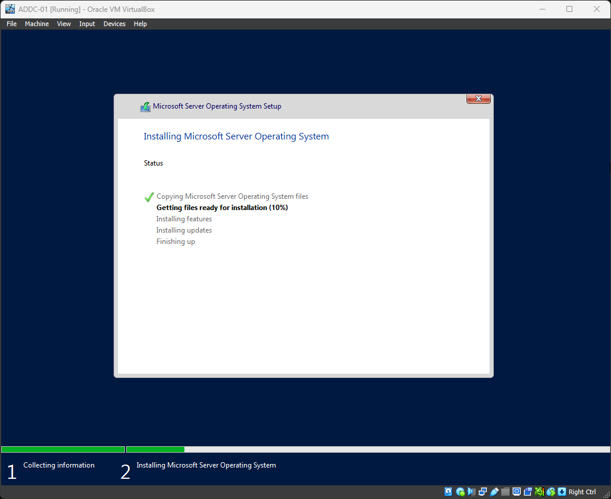

### Install Ubuntu Server

To install Ubuntu Serer onto VirtualBox, I executed the following steps:

1. Navigate to https://ubuntu.com/download/server#manual-install and download the Ubuntu Server 24.04 LTS ISO.
   
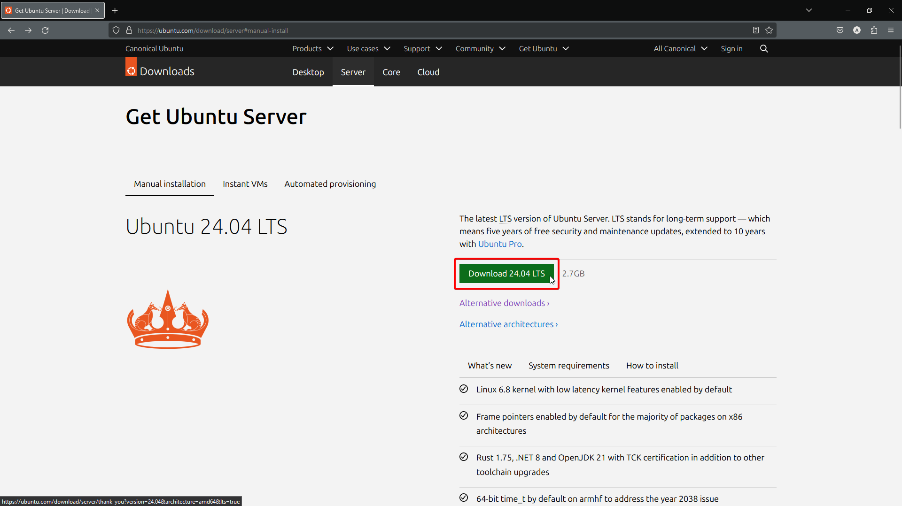

2. After the ISO finishes downloading, open VirtualBox and click 'New' to create a new virtual machine.
3. Set the name to "Splunk", choose a folder, select the Ubuntu Server ISO file previously downloaded, check 'Skip Unattended Installation', and click Next.
   
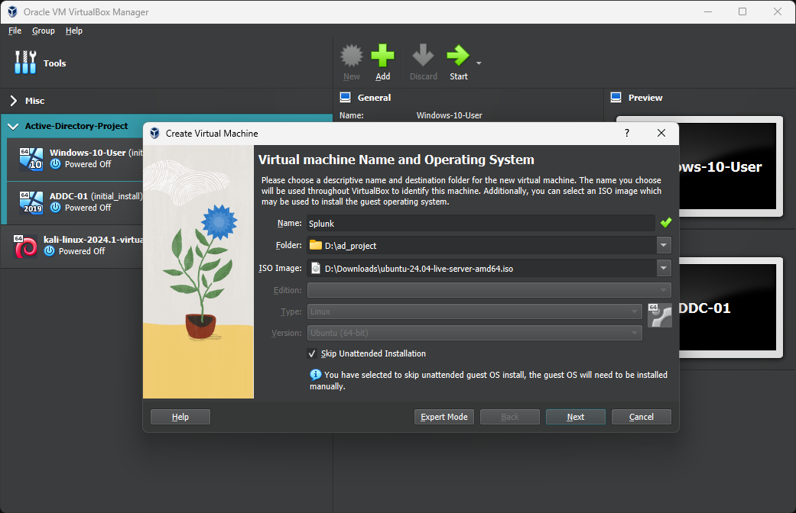

4. Set 'Base Memory' to 4096 MB and 'Processors' to 2 and click Next.
5. Set 'Disk Size' to 100 GB and click Next.
6. Click 'Finish' on the Summary page to finalize the virtual machine install.
7. Click the green arrow labeled 'Start' to power on the machine.
   
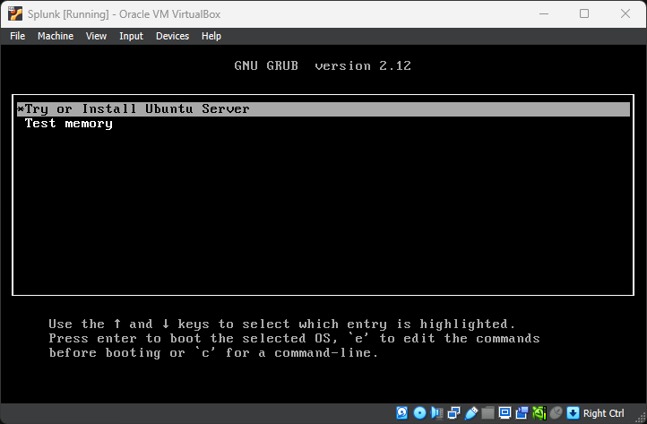

8. For the settings, leave them as default and continue pressing Enter until you reach the Profile configuration page.
9. Fill in the details for the profile configuration and use the down arrow key to reach Done, then press Enter.


10. Continue through the setup with the default settings until you reach the Installing System page and are prompted to 'Reboot Now'.
  
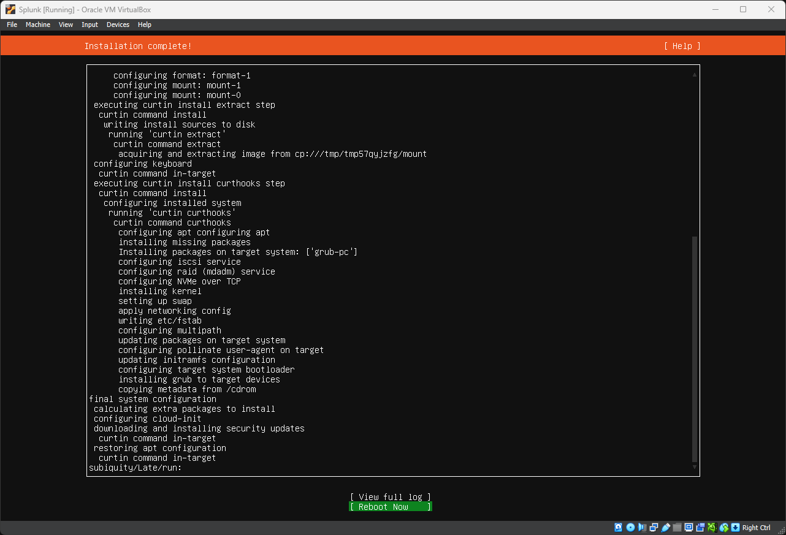

11. Upon rebooting there is an error screen: "Failed unmounting cdrom.mount - /cdrom.", just press Enter to continue.
12. After the successful reboot, login to the server and enter the following command: `sudo apt-get update && sudo apt-get upgrade -y`. This command updates and upgrades repositories.

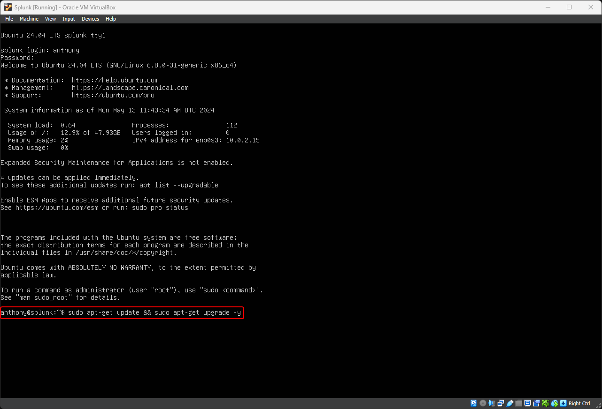

> [!NOTE]
> I changed the base memory of some of the virtual machines, as I added more RAM to my host PC while working on this project.

> [!TIP]
> Take a snapshot of each virtual machine with its default settings. If the machine breaks or becomes unusable, you can restore the machine to its default settings with the snapshot.

## Part 3: Sysmon and Splunk

### Objective: Install and Configure Splunk and Sysmon

For this part, I configured the Splunk Server and installed Sysmon and Splunk on the Windows target machine and Windows Server to facilitate collecting telemetry and sending logs over to Splunk.

### VirtualBox NAT Network Configuration

To allow the virtual machines to be on the same network and have Internet access I configured a NAT network within VirtualBox.

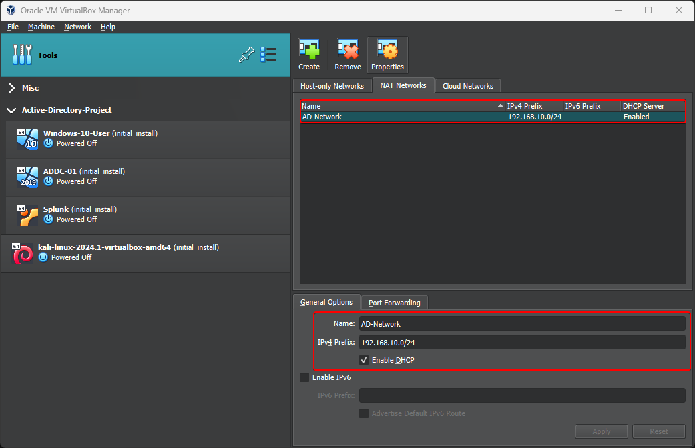

In each virtual machine, I went into the Network settings and changed the adapter to NAT Network and the 'AD-Network' previously created.

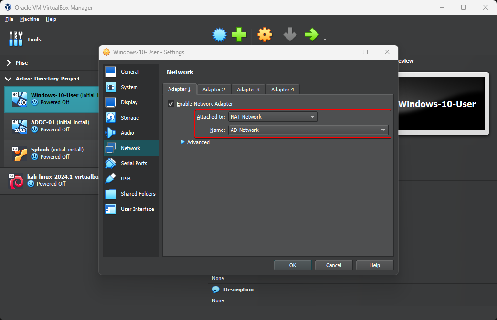

### Splunk Server Configuration

To configure the Splunk server, I executed the following steps:

#### Configure the Splunk machine's IP

1. Use the `ip a` command to check the Splunk server's IP. 

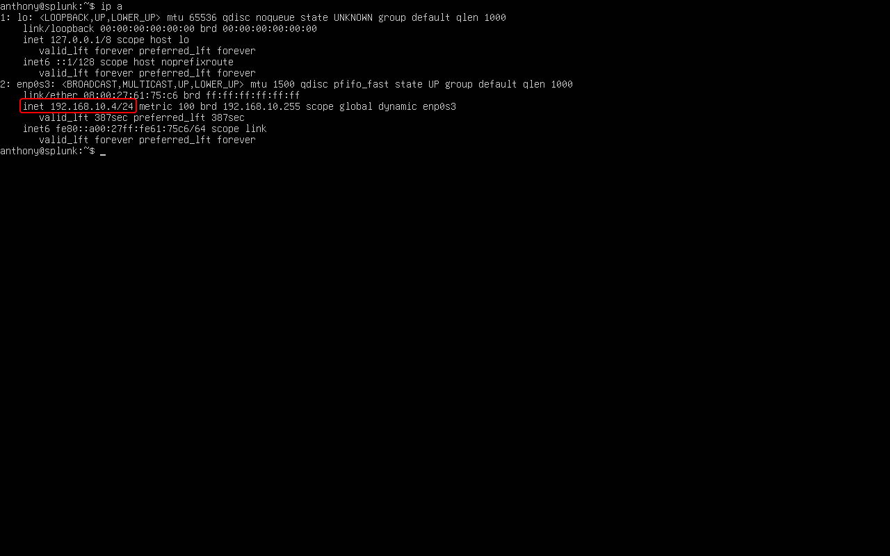

The IP does not match the IP set in the diagram created at the start of the project (`192.168.10.10`).

2. To change the static IP, use the following command to open the network config file with nano:

```
sudo nano /etc/netplan/50-cloud-init.yaml
```
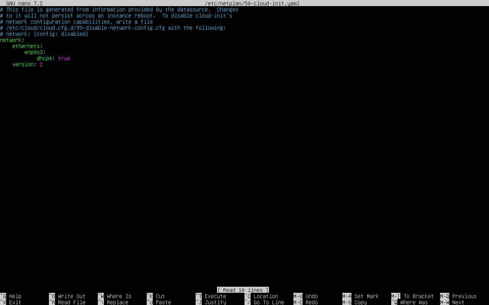

3. Change dhcp4 from `true` to `no` and add the following lines of text under dhcp4:

```YAML
            addresses: [192.168.10.10/24]  # Change IP address to match the diagram
            nameservers:
                addresses: [8.8.8.8]  # Set DNS to Google's DNS
            routes:
                - to: default
                  via: 192.168.10.1  # Configure default route via gateway address
```
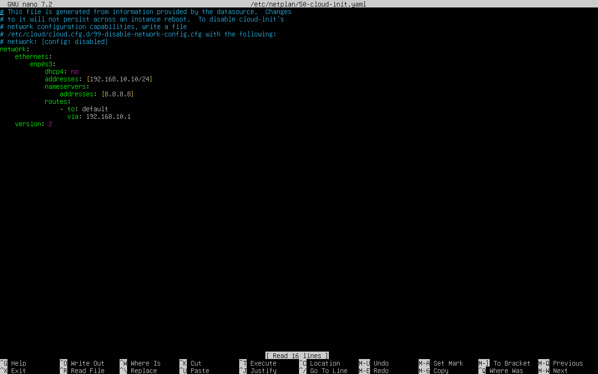

- Save and exit with `Ctrl + X`, `Y`, and `Enter`.
- Use the command `sudo netplan apply` to apply the configuration.
- Use the `ip a` command again, and confirm that the IP matches the diagram.
- Lastly, test network connectivity with the following command: `ping google.com`

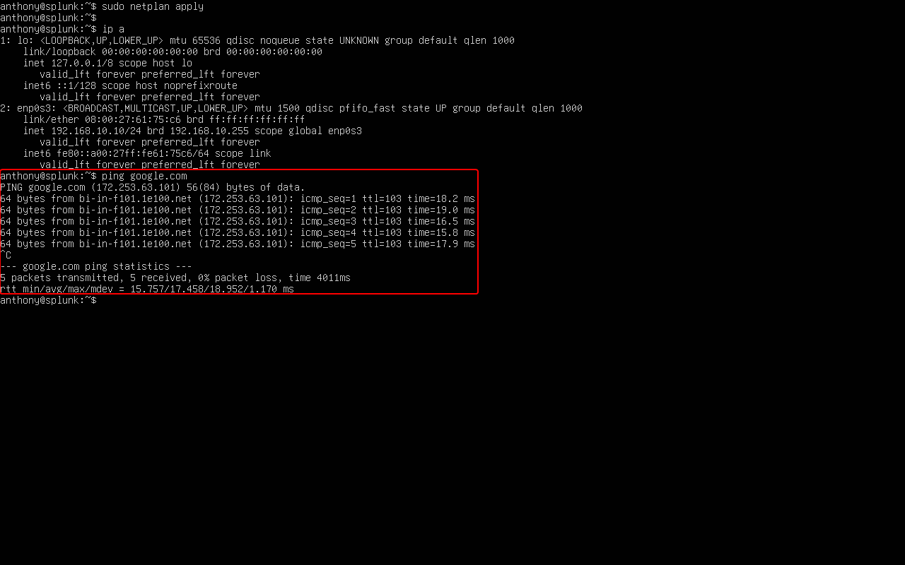

#### Download Splunk

On the host machine navigate to https://www.splunk.com/en_us/download/splunk-enterprise.html and install the Linux Splunk Enterprise `.deb` file.

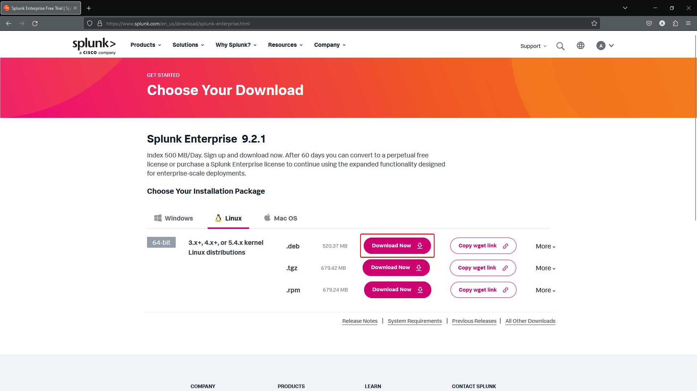

#### Configure guest add-ons for VirtualBox

1. To install guest add-ons for VirtualBox, use the following command:

```
sudo apt-get install virtualbox-guest-additions-iso
```

2. In VirtualBox on the top bar, navigate to Devices -> Shared Folders -> Shared Folder Settings...

- Click the 'Adds new shared folder' icon in the top-right.
- Specify the Folder Path to where Splunk was downloaded on the host machine.
- Check the boxes for `Read-only`, `Auto-mount`, and `Make Permanent`.

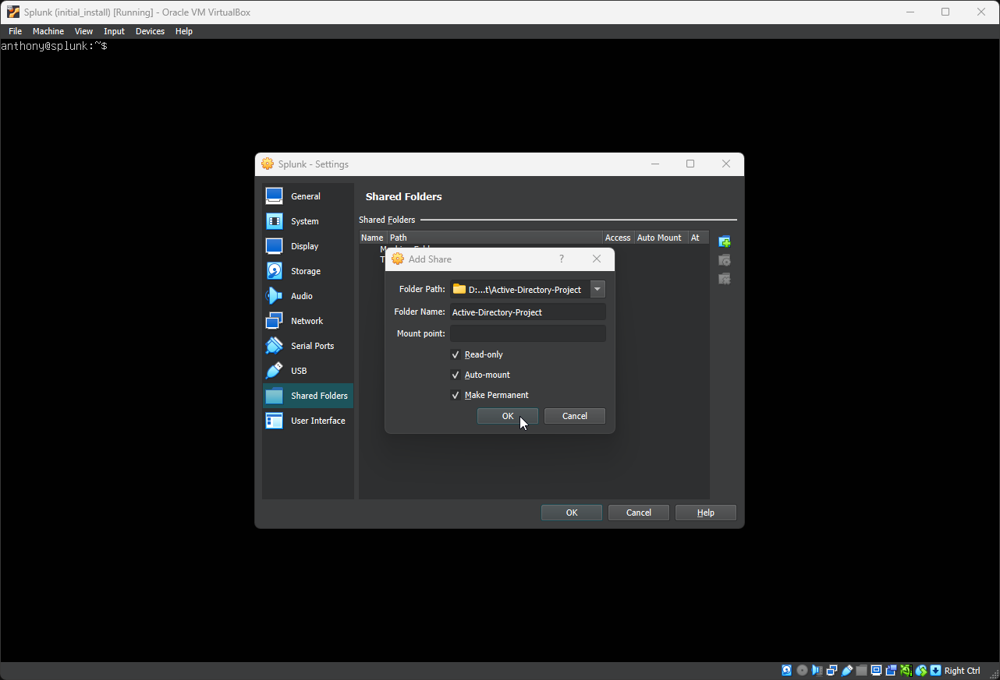

3. Use the command `sudo reboot` to reboot the virtual machine.

#### Add a user to the vboxsf group and mount the shared folder

1. To add the user 'anthony' to the vboxsf group, use the following command:

```
sudo adduser anthony vboxsf
```

- If the error "The group 'vboxsf' does not exist." appears, then use the following command:

```
sudo apt-get install virtualbox-guest-utils
```

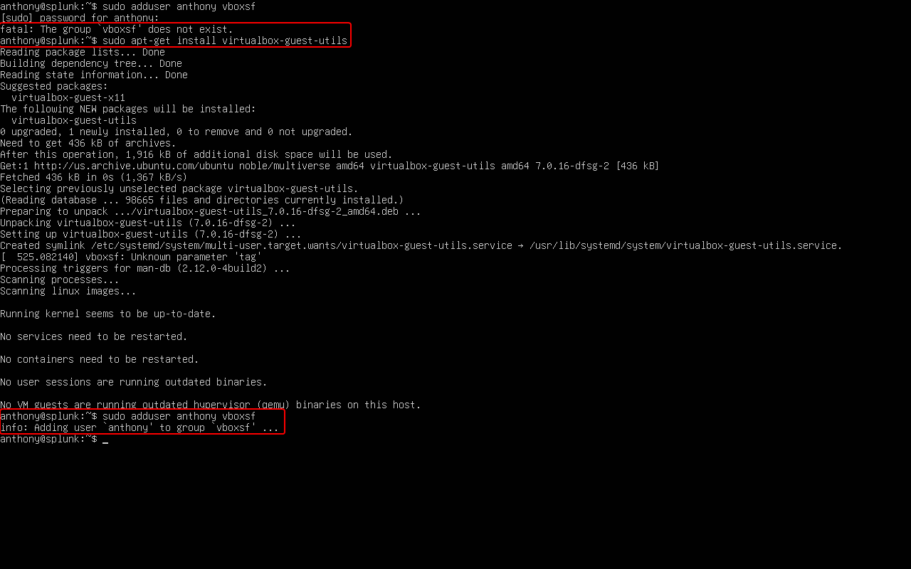

2. Create a directory called "share" with the command `mkdir share`.
3. Mount the shared folder onto the 'share' directory with the following command:

```
sudo mount -t vboxsf -o uid=1000,gid=1000 Active-Directory-Project share/
```

- Change directories to 'share' with `cd share` and display the files with `ls -la`.

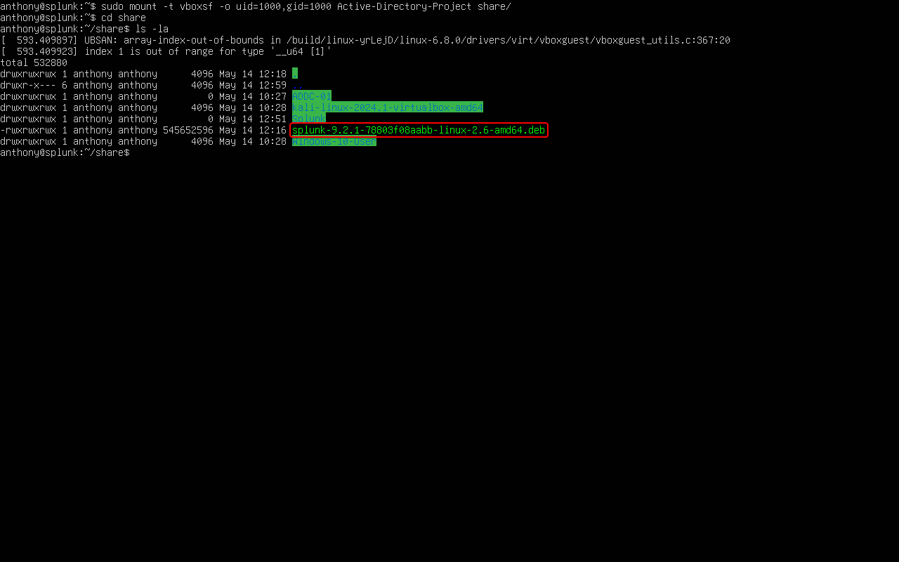

- Notice the Splunk `.deb` file downloaded previously is now accessible within the virtual machine.

#### Install Splunk

1. To install the Splunk package, use the following command:

```
sudo dpkg -i splunk-9.2.1-78803f08aabb-linux-2.6-amd64.deb
```

2. Use `cd /opt/splunk` to change directories to where Splunk is located.

- Using `ls -la`, notice that the user and group permissions belong to 'splunk', meaning that permissions are limited to the 'splunk' user.
- To switch to the 'splunk' user use the command `sudo -u splunk bash`.

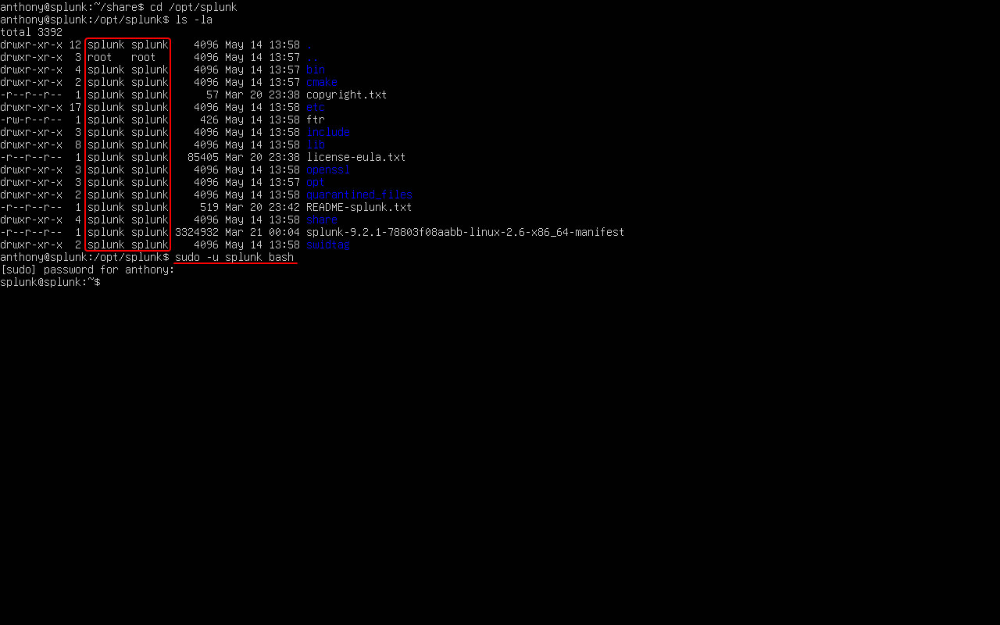

3. Change directories to bin with `cd bin` and run the Splunk installer with `./splunk start`.

- Accept the terms agreement and enter an administrator username and password.

4. Exit the 'splunk' user with `exit`, change directories to bin with `cd bin`, and use the following command to ensure that Splunk starts up each time the virtual machine reboots:

```
sudo ./splunk enable boot-start -user splunk
```

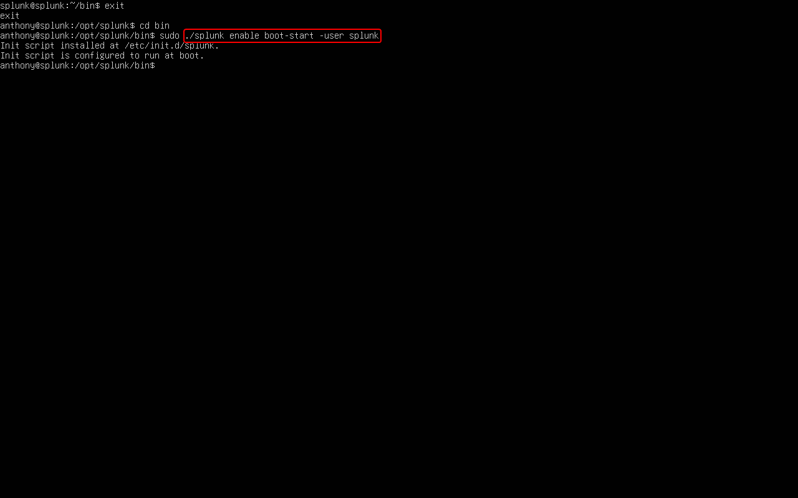

### Windows 10 User Configuration

To configure the Windows 10 user with Splunk and Sysmon, I executed the following steps:

#### Change the Windows 10 machine's hostname

1. Type "View your PC name" in the search box and click 'Open'
2. Click on the `Rename this PC` button and enter the name "Target-PC", then click Next.
   
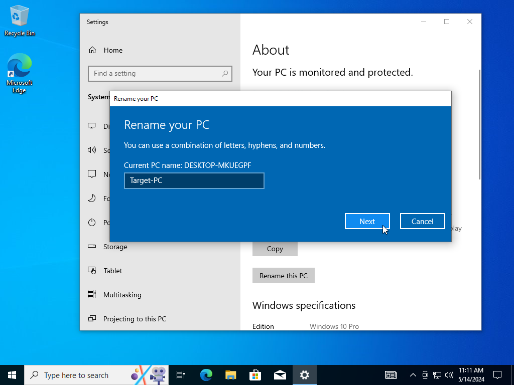

3. Click `Restart now` for the change to take effect.

#### Check the Windows 10 machine's IP

1. Search "cmd" and open Command Prompt.
2. Use the `ipconfig` command to display TCP/IP network configuration values.


- The machine received the IP `192.168.10.5` via DHCP. Because this IP does not conflict with any other machines on the project diagram, it will be left as is.

#### Install Splunk Universal Forwarder

1. Navigate to https://www.splunk.com/en_us/download/universal-forwarder.html and download the Windows 10 64-bit Splunk Universal Forwarder `.msi` file.

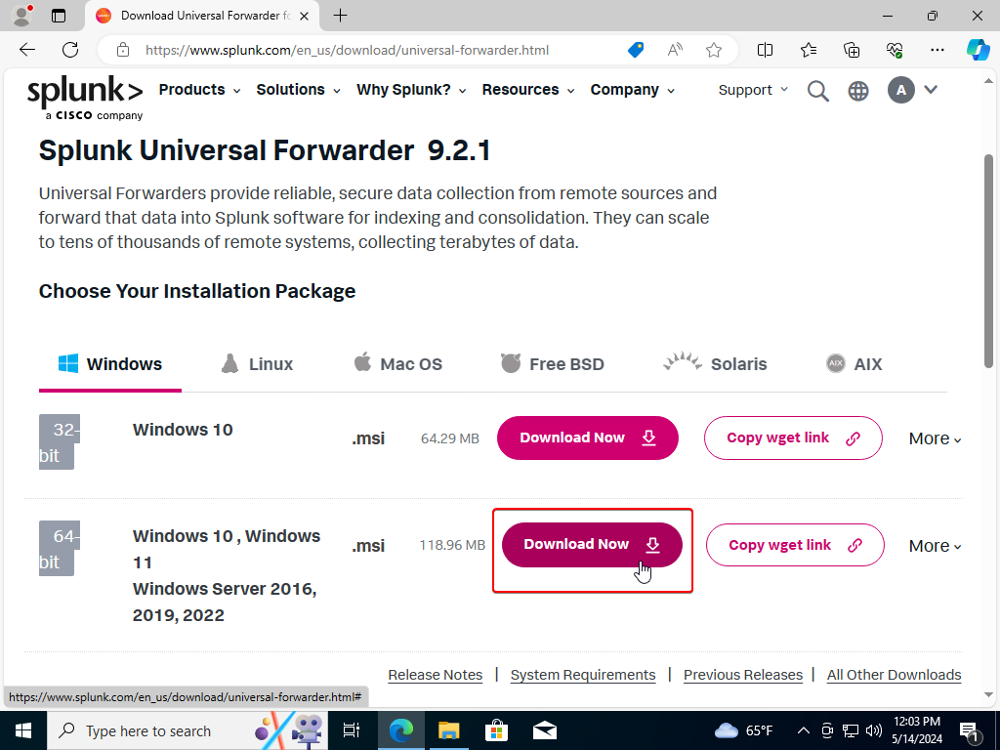

2. Locate the `.msi` file in Downloads and double-click it.
   
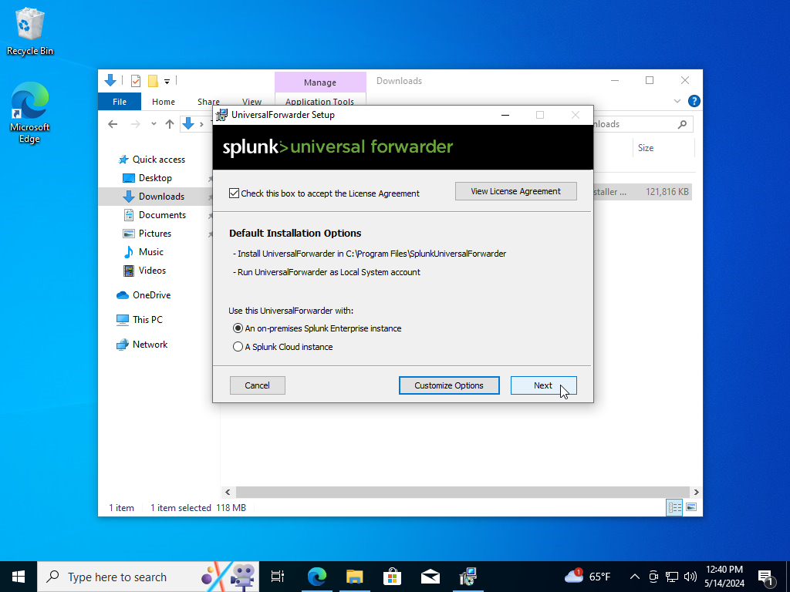

   - Check the box to accept the License Agreement and click Next.
   - Set the Username as "admin" and click Next.
   - Leave the Deployment Server blank and click Next.
   - Set the Receiving Indexer IP to the Splunk Server `192.168.10.10` and the port to `9997` and click Next.
   - Click Install and let the wizard finish installing.
  
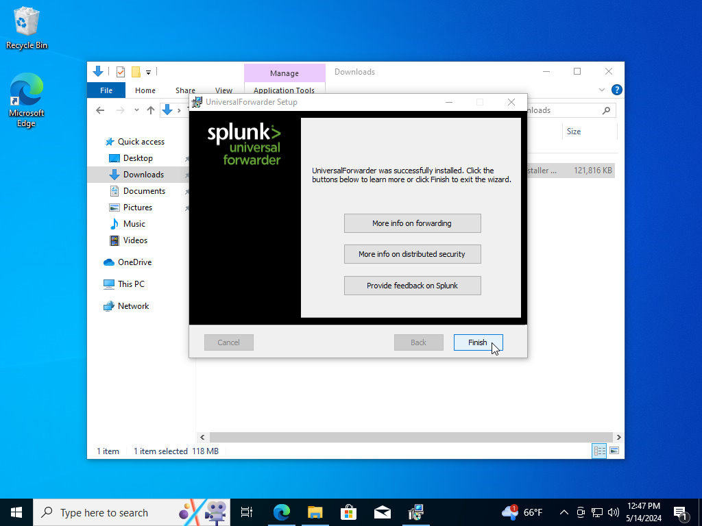

#### Install Sysmon

1. Navigate to https://learn.microsoft.com/en-us/sysinternals/downloads/sysmon and download Sysmon.

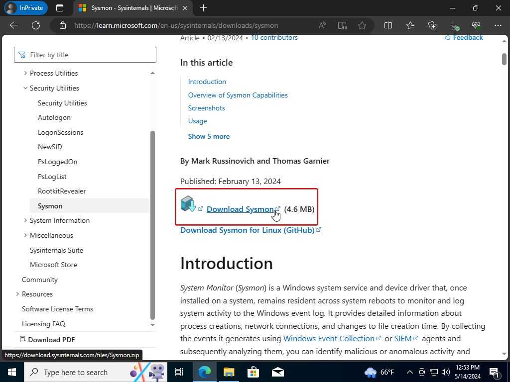

2. Extract the download archive.
  
3. Navigate to https://raw.githubusercontent.com/olafhartong/sysmon-modular/master/sysmonconfig.xml, press `Ctrl + S`, and save the page as an XML Document in the Downloads folder.

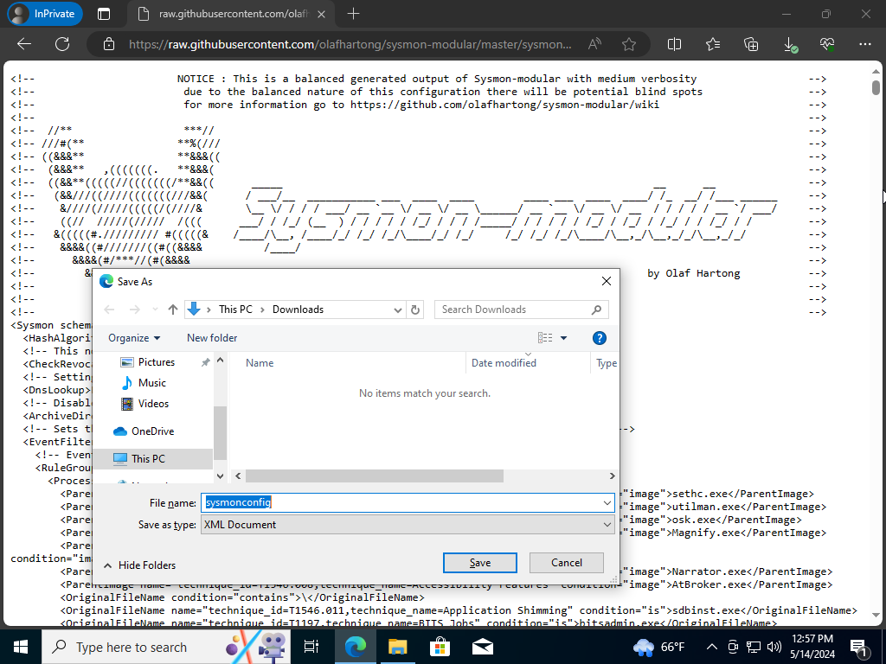

4. Run PowerShell as administrator, change directories to the Sysmon directory with `cd C:\Users\anthony\Downloads\Sysmon`, and use the following command to install Sysmon with the previously downloaded configuration file.

```
.\Sysmon.exe -i ..\sysmonconfig.xml
```

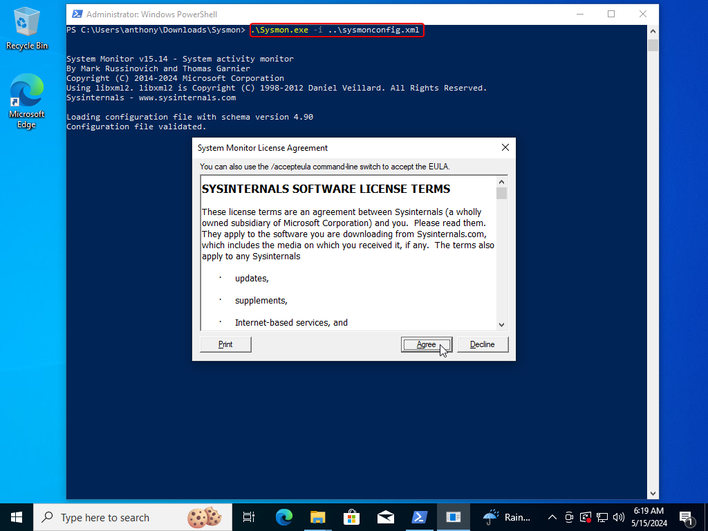

- Agree to the terms and Sysmon will install.

#### Specify what logs from the Windows 10 machine to send to Splunk

1. Run Notepad as administrator and add the following text:

```
[WinEventLog://Application]
index = endpoint
disabled = false

[WinEventLog://Security]
index = endpoint
disabled = false

[WinEventLog://System]
index = endpoint
disabled = false

[WinEventLog://Microsoft-Windows-Sysmon/Operational]
index = endpoint
disabled = false
renderXml = true
source = XmlWinEventLog:Microsoft-Windows-Sysmon/Operational
```

- This configuration sends application, security, system, and Sysmon events over to the Splunk Server. The index 'endpoint' will need to be configured within Splunk later.

2. Save the file as "inputs.conf" in the `C:\Program Files\SplunkUniversalForwarder\etc\system\local` directory.

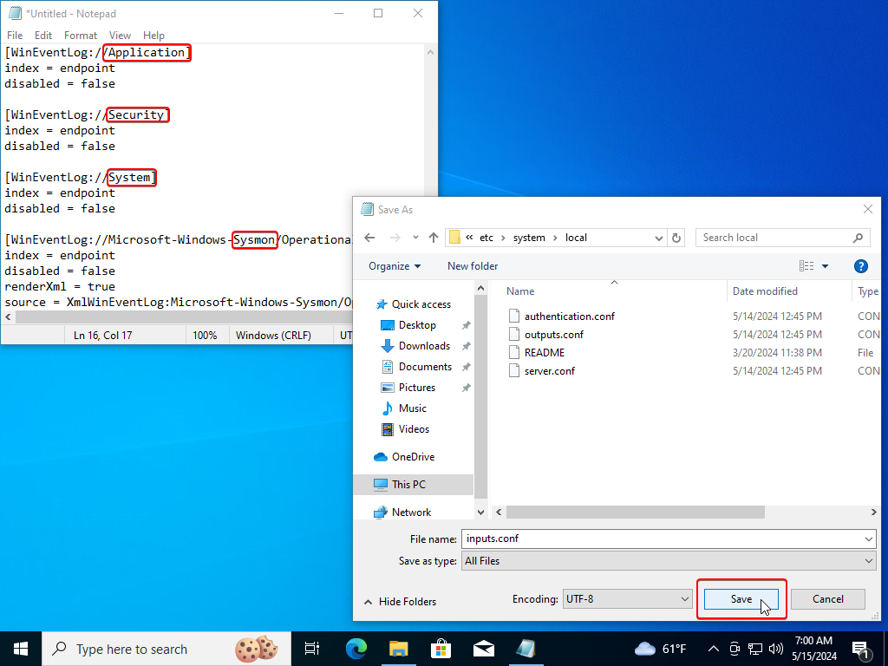

- Whenever inputs.conf is updated, the SplunkForwarder service must be restarted.

3. Run Services as administrator and locate the 'SplunkForwarder' service.

- Double-click the service and under 'Log On' select the option 'Local System account' and click Apply.
  
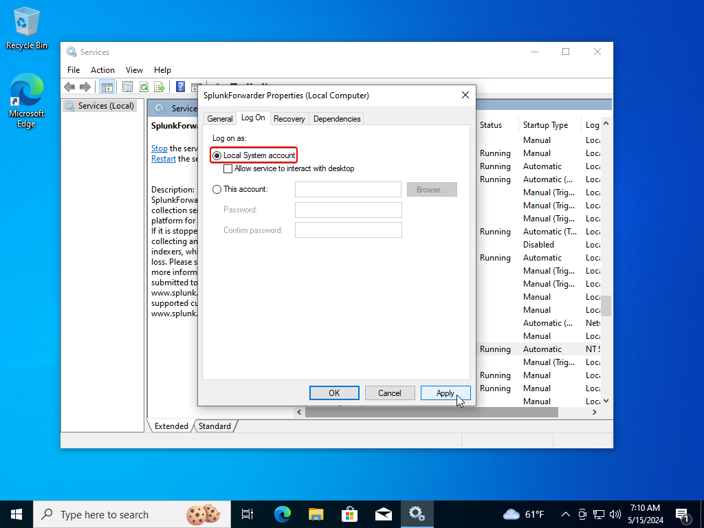

- Click 'Restart' to restart the service. There may be an error when attempting to restart, but the option to start the service should appear.

#### Finalize the Splunk Server configuration

1. Navigate `192.168.10.10:8000` to access the Splunk Server's web portal and log in. 

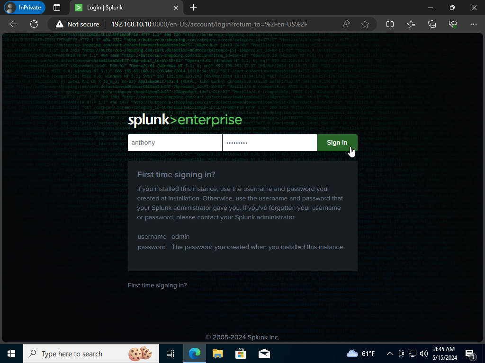

2. Click 'Settings' on the top bar (Splunk Bar) and under 'DATA' click 'Indexes'
3. Click `New Index` and create a new index named "endpoint".

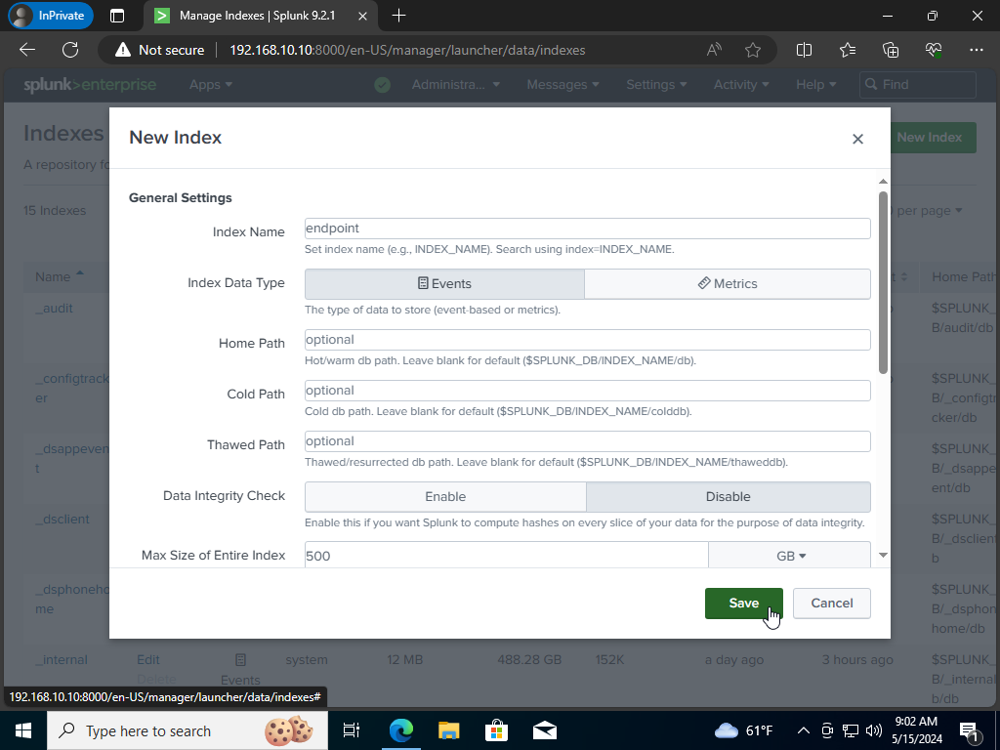

Next, the Splunk Server must be enabled to receive data from the endpoint.

4. Click 'Settings' on the Splunk Bar and under 'DATA' click 'Forwarding and receiving'.
5. Under 'Receive data' click 'Configure receiving' and click `New Receiving Port`.
6. To configure the receiving port "9997" type "9997" and click `Save` 

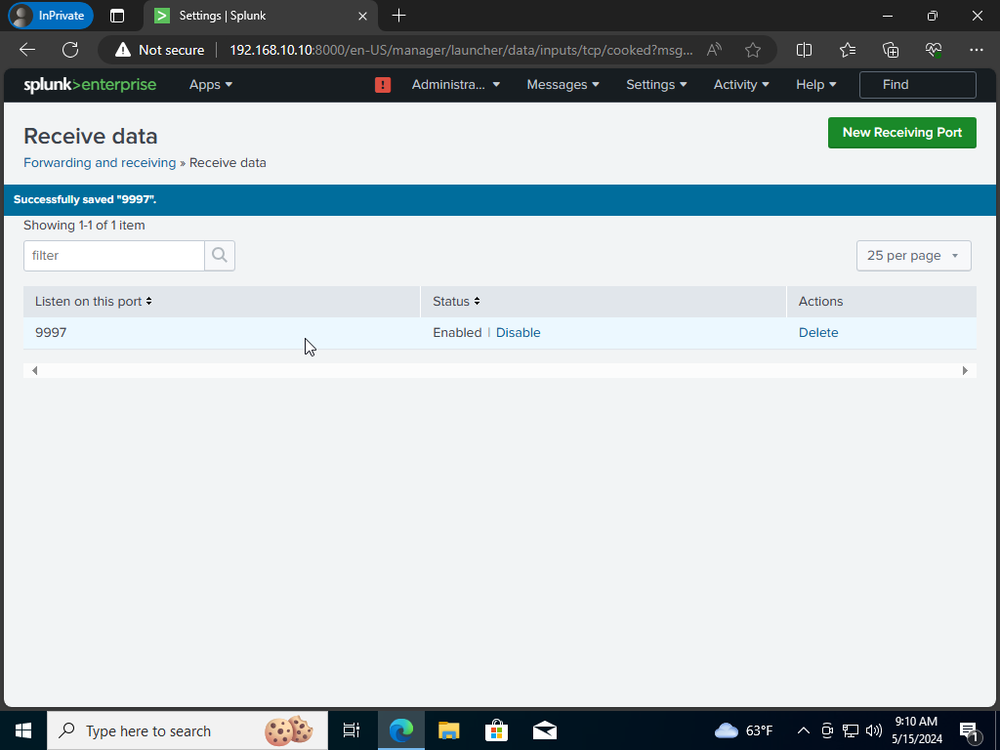

- To check if data is coming in from the endpoint switch to the 'Search & Reporting' app and input the following query:

```
index=endpoint
```

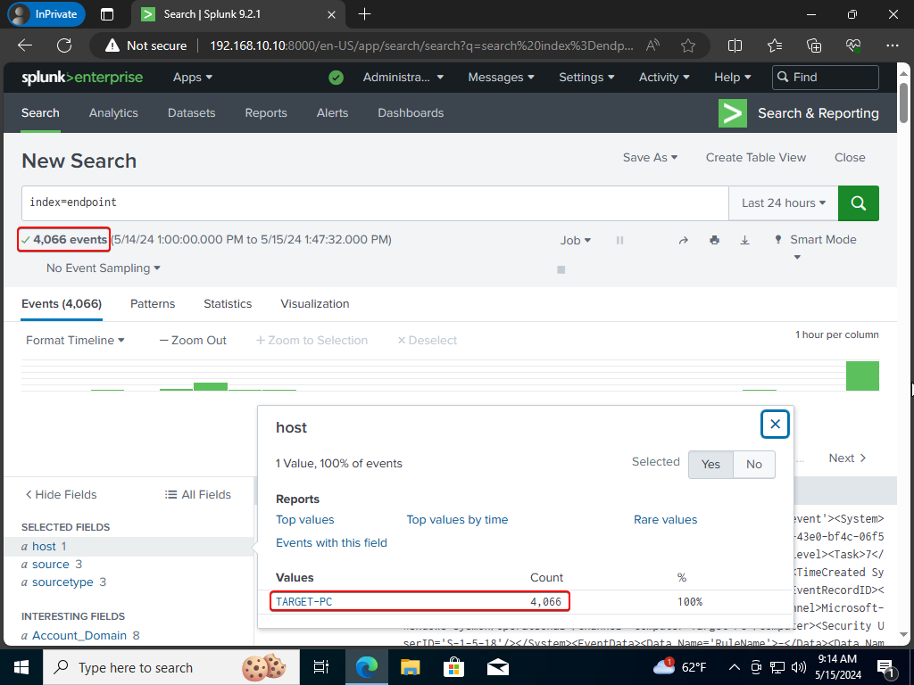

> [!NOTE]
> At first the System event log source was not being shown in Splunk. After troubleshooting, I found that the System source appears when changing the Splunk search timeframe from 'Last 24 hours' to 'All time'. This didn't appear to fix the problem, but what did was when I went into the Time & Date settings and changed the 'Time zone' and 'Set time automatically' settings to match my time zone.

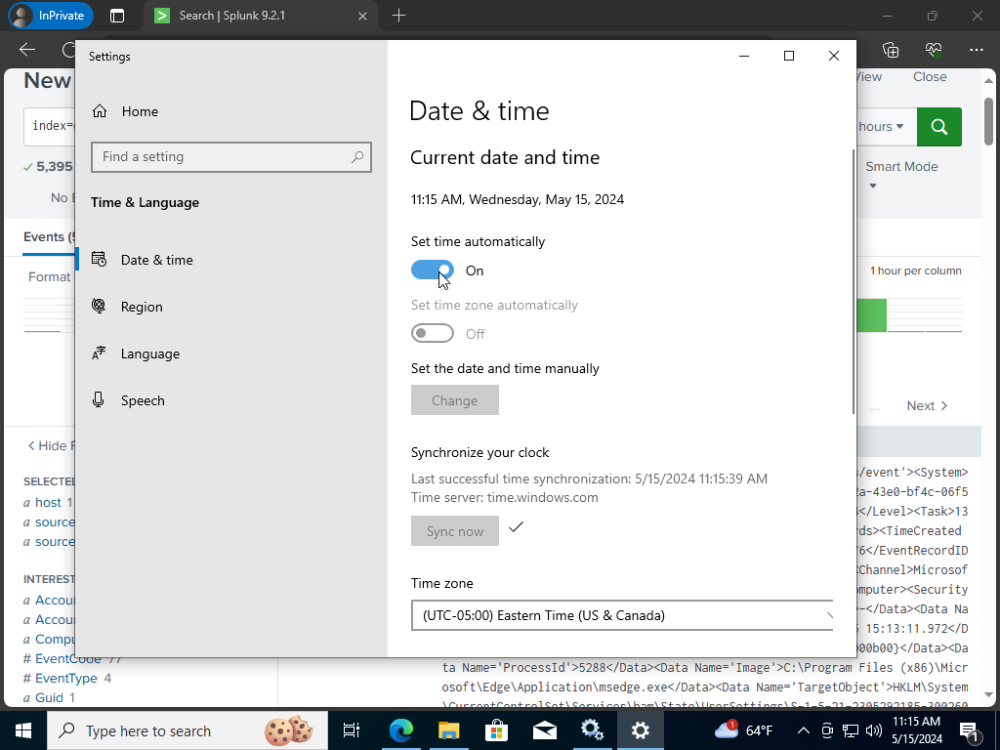

### Windows Server 2022 Configuration

The steps to configure the Windows Server virtual machine with Splunk and Sysmon are very similar to the Windows 10 machine. Thus, I will provide a rough outline of the steps rather than repeating the same detailed documentation.

1. Change the hostname of the Windows Server to "ADDC-01" and restart the computer.
2. Change the IP of the Windows Server to "192.168.10.7". 

- The IP properties can be accessed by searching and clicking "Ethernet Settings", selecting 'Change adapter options', right-clicking 'Ethernet' and selecting 'Properties', and double-clicking 'Internet Protocol Version 4 (TCP/IPv4).

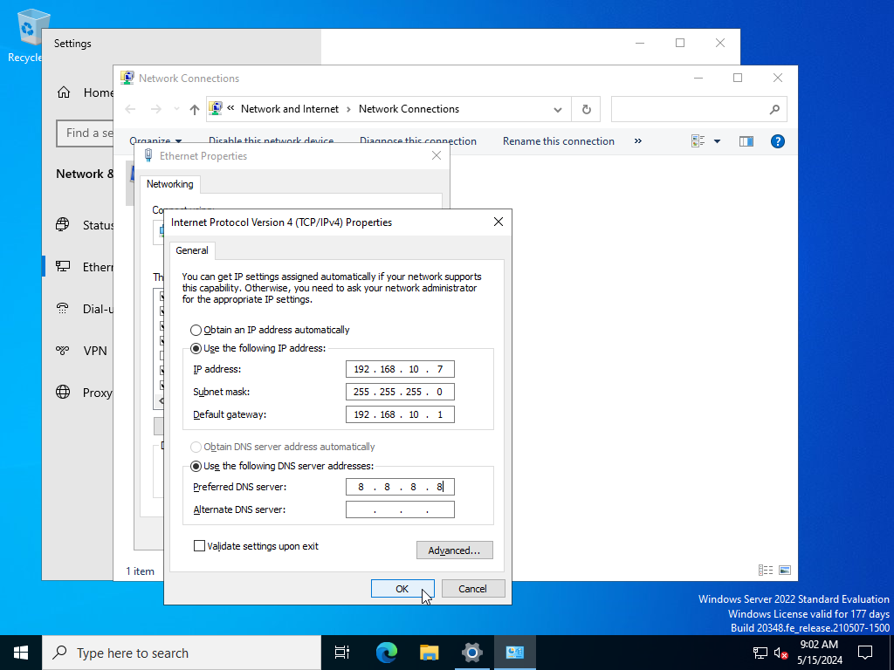

3. Download and install Splunk Universal Forwarder.
4. Download and install Sysmon, specifying Olaf Hartong's configuration file.
5. Create the same `inputs.conf` file as done with the Windows 10 machine.
6. Go into Services, change the SplunkForwarder's 'Log On' to 'Local System Account', and restart the service. 
7. Go to Splunk Web and perform the same query as before (`index=endpoint`). There should be 2 hosts now, `TARGET-PC` and `ADDC-01`.
   
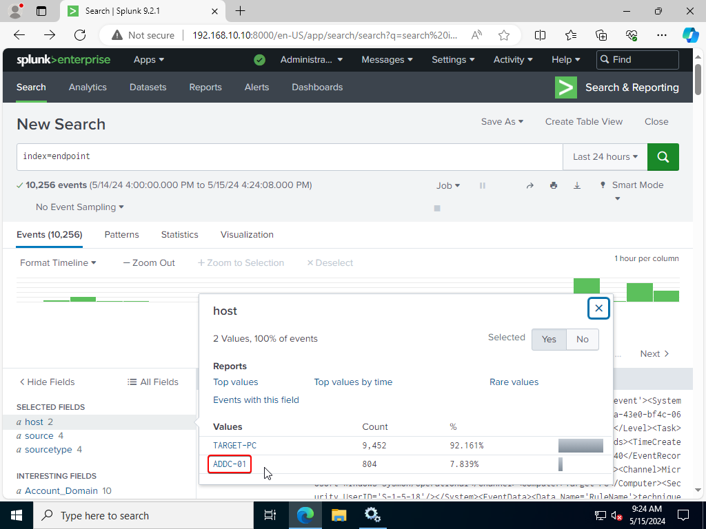

## Part 4: Active Directory

### Objective: Install and Configure Active Directory

The goal for this part was to install/configure Active Directory onto the Windows Server, promote it to a domain controller, and configure the Windows 10 machine to join the domain. To accomplish this goal, I executed the following steps:

#### Setup Active Directory

1. Open Server Manager and click 'Manage' in the top right corner, then select 'Add Roles and Features'.

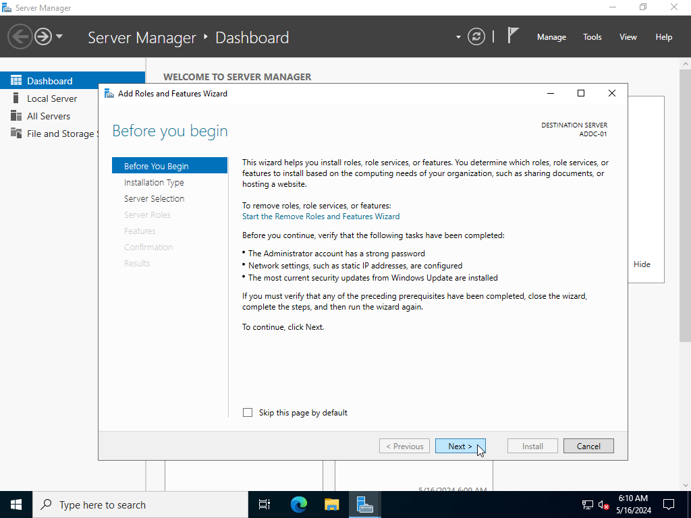

2. Continue through the wizard leaving the default settings until reaching Features. Check the box next to 'Active Directory Domain Services' (AD DS) and continue to the Confirmation page, making sure to click 'Install' and wait for it to finish.

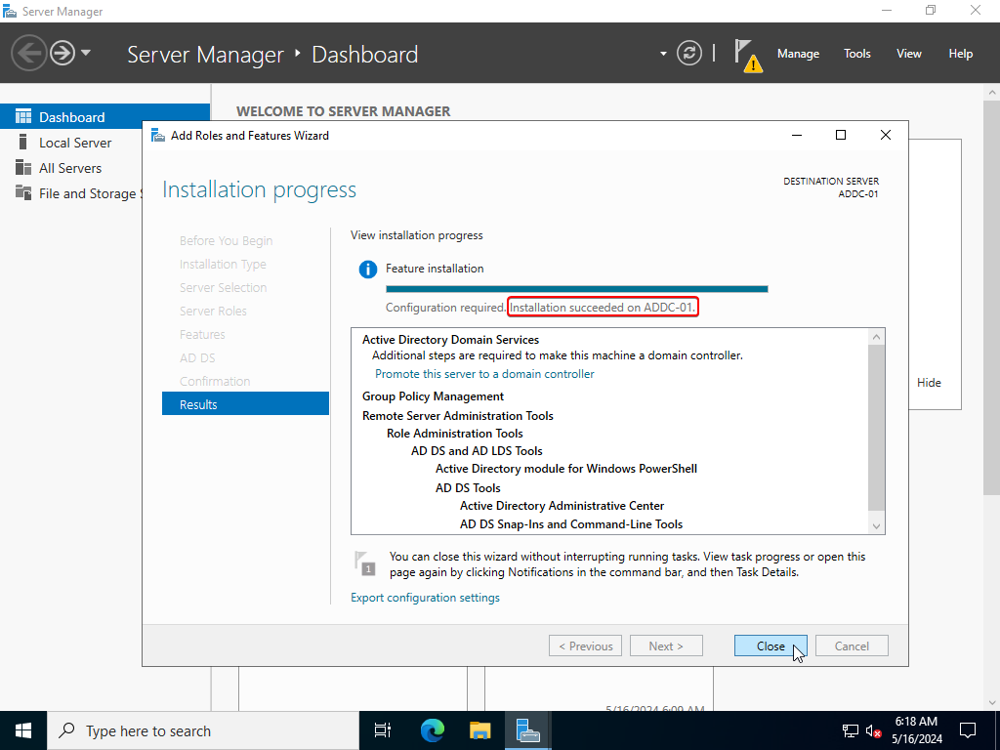

3. Click on the flag icon with the warning symbol next to 'Manage' and select 'Promote this server to a domain controller'. 

4. On the Deployment Configuration page of the wizard select 'Add a new forest', enter the root domain name "homelab.test", and click Next.

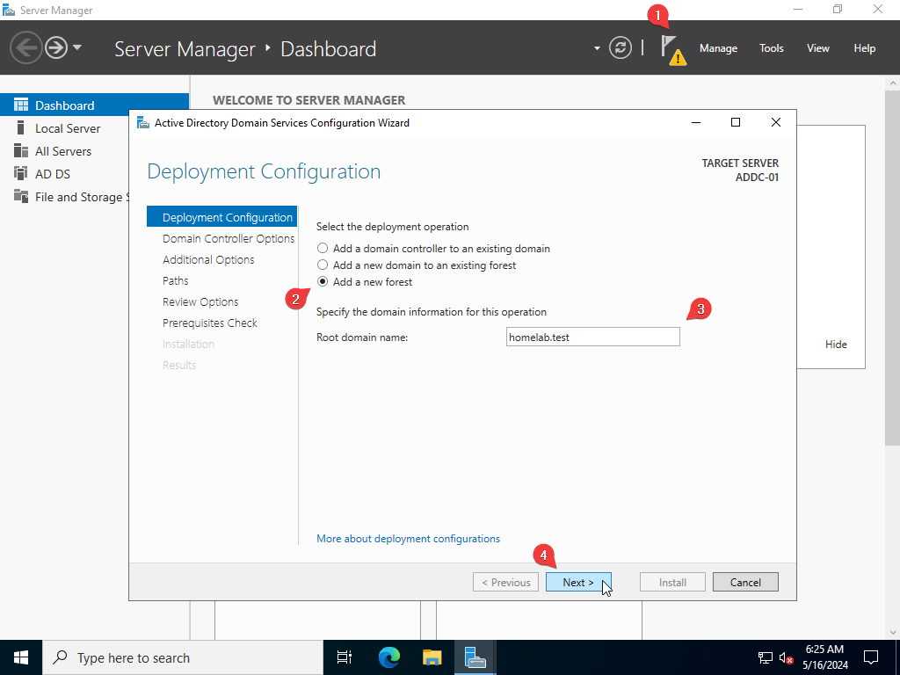

5. On the Domain Controller Options page enter a password for Directory Services Restore Mode (DSRM) and continue through the wizard until reaching the Prerequisites Check page.
6. Wait for the wizard to finish checking prerequisites, then click 'Install'. The machine will automatically restart once finished installing.
  
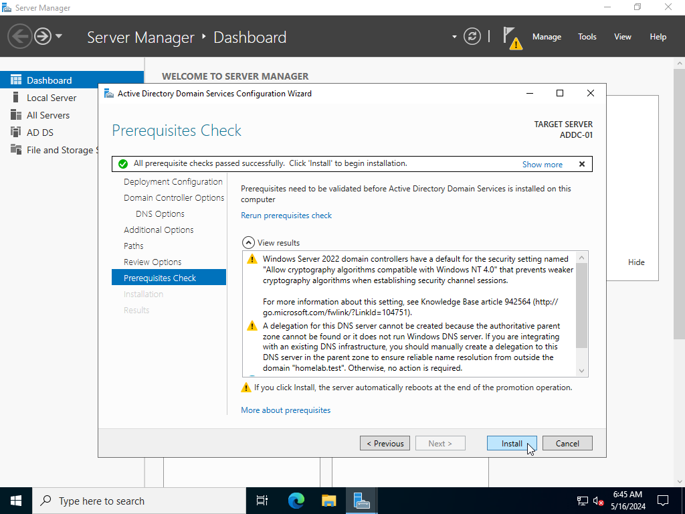

- Upon restarting, the login screen displays `HOMELAB\Administrator` indicating that AD DS has successfully installed.

#### Add an Organizational Unit (OU) and a User

1. In Server Manager, click 'Tools' in the top right corner and select 'Active Directory Users and Computers'
2. Right-click on `homelab.test`, select New, and click Organizational Unit.

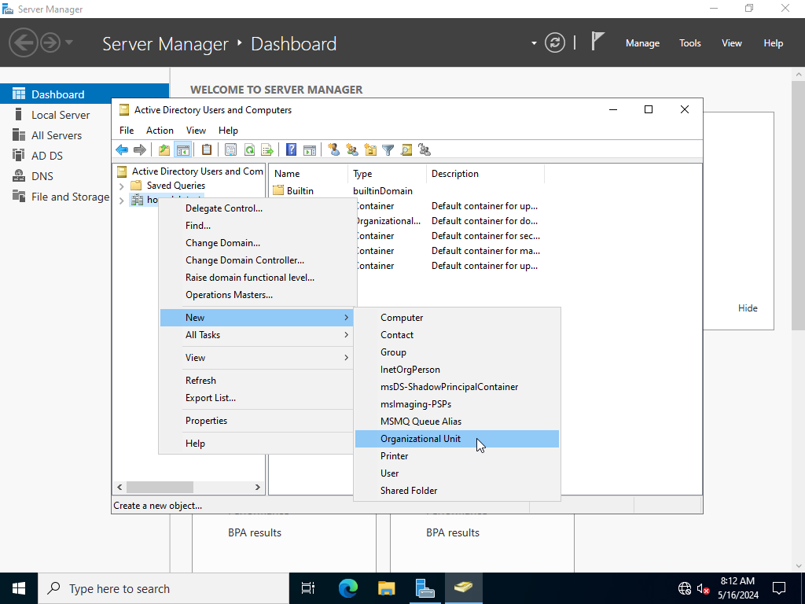

- Set the name to IT and click OK.

3. Right-click on the 'IT' OU just created and select New, then click User.
  
4. Add the User with the First name "John", Last name "Doe", and User logon name "jdoe" and click Next.

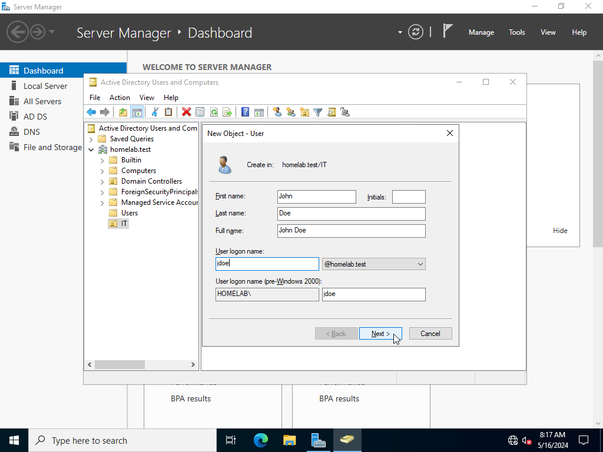

6. Enter a Password and uncheck the box 'User must change password at next logon' since this is a lab environment and click next. Click Finish on the last page to finalize the user creation.

#### Utilize PowerShell to create a user creation script

I took the opportunity to learn more about PowerShell and created a simple script to add some automation to the user creation for Active Directory.

I created a new OU called "HR" in Active Directory. To create the script I used PowerShell ISE ran as administrator. 
   


By watching tutorials by [NetworkRick Labs](https://www.youtube.com/watch?v=SbAo0_UFJYU) and [KELVGLOBAL ICT](https://www.youtube.com/watch?v=0P1nhu1pENE) and reading the PowerShell documentation, I managed to create the following script:

``` PowerShell
"`n"
Write-Host "Welcome to the AddUser script!"
"`n"
"Please fill out the following information to create a new user." 
"`n"

# Initialize variables

$firstName  = ""
$lastName   = ""
$username   = ""
$fullName   = ""
$password   = ""

$i = 0
$parameter  = ""
$promptText = ""

# Iterate and assign values to the variables for the firstname, lastname, and username

while ($i -le 2)
{
    if ($i -eq 0)
    {
        $promptText = "Enter the user's first name"
    }
    elseif ($i -eq 1)
    {
        $promptText = "Enter the user's last name"
    }
    elseif ($i -eq 2)
    {
        $promptText = "Enter the user's username"
    }

    Do
    {
        $parameter = Read-Host -Prompt $promptText
    } while ($parameter -eq "")

    if ($i -eq 0)
    {
        $firstName = $parameter
    }
    elseif ($i -eq 1)
    {
        $lastName = $parameter
    }
    elseif ($i -eq 2)
    {
        $username = $parameter
    }

    $i++
}

# Check if the User already exists in Active Directory

if (Get-ADUser -Filter {SamAccountName -eq $username})
{
    Write-Warning "User account $username already exists in Active Directory."
    exit
}
else
{
   Write-Host "Which Department does the user belong to?"

   # Assign values to the department and password variables

   Do 
   {
        $department = Read-Host -Prompt "[1] IT [2] HR"
        if ($department -notmatch '^[1-2]+$') 
        {   
            Write-Warning "Please enter a number: 1 or 2."
        }
   } while ($department  -notmatch '^[1-2]+$')
   $password = Read-Host -Prompt "Enter the user's password"

   # Change value of the department variable to match the chosen OU

   if ($department -eq 1) 
   {
        $department = "IT"
   }
   elseif ($department -eq 2)
   {
        $department = "HR"
   }
}

# Create the user based on the previously assigned variables

New-ADUser `
-Name "$firstName $lastName" `
-GivenName $firstName `
-Surname $lastName `
-SamAccountName $username `
-UserPrincipalName $username `
-AccountPassword (ConvertTo-SecureString $password -AsPlainText -Force) `
-Path "OU=$department,DC=homelab,DC=test" `
-Enabled $true

Get-ADUser -Identity $username

Write-Host "User $username successfully created!"
```


The script mainly utilizes the `New-ADUser` cmdlet. I inserted text prompts that ask the user for various parameters such as first name and username. Another feature I added was a check to see if the user account inputted already exists. If it does, then the script outputs a warning and exits.


In the following GIF, I demo using the script to create a new user based on the table below:

| New-ADUser Parameter | Value |
| --- | --- |
| `-Name` | Ashley Doe |
| `-GivenName` | Ashley |
| `-Surname` | Doe |
| `-SamAccountName` | adoe |
| `-UserPrincipalName` | adoe |
| `-AccountPassword` | P@ssw0rd |
| `-Path` | OU=HR,DC=homelab,DC=test |
| `-Enabled` | $true |


#### Configure the Windows 10 machine to join the domain

1. In the Windows 10 machine, search for "PC" and select 'Properties'.
2. In the PC About page, scroll to the bottom and select 'Advanced systems settings'.
3. In System Properties, switch to the 'Computer Name' tab and click 'Change...'.
4. In the Computer Name/Domain Changes window, select 'Domain' and type "HOMELAB.TEST" and click OK.


5. Upon clicking OK an error may appear:


- The AD DC for the domain could not be contacted.
- To resolve this error the DNS server for this machine must be set to the domain controller (`192.168.10.7`).

1. The DNS server can be assigned in the IP properties window. The IP properties can be accessed by searching and clicking "Ethernet Settings", selecting 'Change adapter options', right-clicking 'Ethernet' and selecting 'Properties', and double-clicking 'Internet Protocol Version 4 (TCP/IPv4).
2. Select 'Use the following DNS server addresses' and change the 'Preferred DNS server' to `192.168.10.7` then click OK.


- Confirm that the DNS server is set properly by using the `ipconfig /all` command in Command Prompt.


8. Go back to the 'Computer Name/Domain Changes' window and click OK.
9. A prompt appears asking for credentials, enter the administrator credentials for the AD DS server and click OK. A window will appear welcoming the user to the new domain and the system will need to restart to apply the new settings.


- After the restart, the computer can be used to log in as one of the previously created domain users.


## Part 5: Kali Linux and Atomic Red Team (ART)

### Objective: Perform a brute force attack and set up ART

In this final part of the project, I installed a tool called Crowbar to brute force the password of one of the domain users. I also installed Atomic Red Team (ART) onto the target machine to generate telemetry based on tactics, techniques, and procedures (TTPs) of threat actors. In Splunk, I performed searches and identified the brute force traffic and the ART telemetry. These tasks were completed by executing the following steps:

#### Enable RDP on the target machine

The brute force attack will utilize Remote Desktop Protocol (RDP), so I needed to enable it on the target machine.

1. Search "PC" and click 'Properties'.
2. Click 'Advanced system settings'.
3. Click on the 'Remote' tab and select 'Allow remote connections to this computer'.
4. Click 'Select Users...' then click 'Add...' and add the users previously created.
5. Click 'Apply' to apply the settings.


#### Configure the Kali Linux machine's IP

1. Right-click the ethernet icon in the top right and select 'Edit Connections...'.
2. Select 'Wired connection 1' and click the cog icon.
3. Switch to the 'IPv4 Settings' tab, change the method to 'Manual', and click 'Add' to add the following:
- Address: `192.168.10.250`
- Netmask: `24`
- Gateway: `192.168.10.1`
- DNS servers: `8.8.8.8`
4. Click 'Save'.


- For the changes to take place disconnect and reconnect the wired connection.
- Use the command, `mkdir ad_project` to make a directory for this project.

#### Use Nmap to scan the target machine

I used a Nmap to perform a basic port scan with the following command:

```
nmap -vv -Pn 192.168.10.5
```

The `-vv` flag specifies verbose level 2 and the `-Pn` flag scans the target without using ping (Windows machines block pings by default). `192.168.10.5` is the target machine's IP address.


- Port `3389` is open, which is the port for RDP.

#### Install Crowbar and download a password list

1. Use `sudo apt-get update && sudo apt-get upgrade -y` to update and upgrade repositories.

2. Install crowbar with `sudo apt-get install -y crowbar`.
  
> [!WARNING]
> Only use this tool on machines that you own or have explicit permission to test.


3. Download the '2023-200_most_used_passwords' list from Daniel Miessler's [SecLists](https://github.com/danielmiessler/SecLists) repository.

```
wget https://raw.githubusercontent.com/danielmiessler/SecLists/master/Passwords/2023-200_most_used_passwords.txt
```


#### Perform a brute force attack with Crowbar

1. Use the following command:

```
crowbar -b rdp -u adoe -C 2023-200_most_used_passwords.txt -s 192.168.10.5/32
```

- `-b` specifies the service.
- `-u` specifies the user.
- `-C` specifies the password list.
- `-s` specifies the target IP.


#### Check Splunk for evidence of the brute force attack

1. Use the search, `index=endpoint adoe`.


- Notice the EventCode `4625` with a count of 201.
- This event ID corresponds to a failed log-on.
  


> [!NOTE]
> In Splunk, the time of events was out of sync between my various virtual machines. Setting up a NTP server would probably fix this issue.

2. Create a table to better show the results:

```
index=endpoint adoe EventCode=4625 | table
_time, EventCode, Source_Network_Address, Workstation_Name
```
  


- The multiple failed login attempts occurred around the same time, indicating that this was likely a brute-force attack.

3. Change the query's EventCode to `4624`.


- The EventCode 4624 corresponds to a successful log-on.
- Thus, during the attack, there was one successful log-on.

> [!TIP]
> To protect against a brute force attack like this in the future, the following measures should be set up:
> - Change the user's password to something more complex.
> - Set firewall rules to only allow a specific set of IP traffic to and from port 3389 (RDP).
> - Configure remote access client account lockout.

#### Installing Atomic Red Team

1. Before installing ART, run the following command in PowerShell:

```
Set-ExecutionPolicy Bypass CurrentUser
```


- Also, set an exclusion for the C drive, as Microsoft Defender may detect and remove some of the files from ART.
  - Windows Security -> Virus & threat protection -> Manage settings -> Add or remove exclusion -> Add an exclusion -> Folder -> Select the C drive.


2. Install ART

```
IEX (IWR https://raw.githubusercontent.com/redcanaryco/invoke-atomicredteam/master/install-atomicredteam.ps1 -UseBasicParsing);
Install-AtomicRedTeam -getAtomics
```


#### Example use of ART

1. Choose a MITRE ATT&CK technique to simulate (in this case I used Command and Scripting Interpreter: PowerShell `T1059.001`). 
   


2. Use the command, `Invoke-AtomicTest T1059.001` to run the test.


3. In Splunk use the query `index=endpoint powershell` to view the telemetry generated from ART.


- One of the tests executed was 'Powershell XML requests'.


- Adding "XML" to the query, the event appears within Splunk:


With the data from ART, rules could be set up within Splunk to detect and alert on this kind of malicious activity.

## Conclusion

In this project, I gained experience in virtual machines, Splunk, Active Directory, Kali Linux, and Atomic Red Team. I installed four virtual machines: Windows 10, Windows Server, Ubuntu Server, and Kali Linux. I configured Splunk Universal Forwarder on the Windows machines to forward event logs and Sysmon logs over to Splunk. I installed and configured Active Directory on the Windows Server and created a PowerShell script to help automate creating new users. I utilized Kali Linux to perform a brute force attack on one of the domain users and identified the event logs of the attack in Splunk. Lastly, I installed Atomic Red Team on the Windows target machine to simulate an adversary PowerShell Execution Technique.

Overall, this project gave me good experience installing and configuring multiple virtual machines as well as connecting them to perform certain functions. Next time for my documentation, it may be more efficient to highlight key steps and configurations instead of attempting to document every step of the process.

Thanks again to [MyDFIR](https://www.youtube.com/@MyDFIR) for providing the project idea and guide on his YouTube channel.
